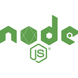
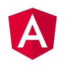

   <h1>Hi there, I'm <a href="https://sheinko.space">Shein Ko</a>  </h1>

  &nbsp;&nbsp;
  &nbsp;&nbsp;

<h3> 💻 Full Stack Developer | 🛸 Myanmar </h3>

## Skills

### Languages

### Frameworks

### Databases

### Tools & Technologies

---

Feel free to reach out to me on <a href="https://t.me/thisiscross">Telegram</a>. I'm always interested in new collaborations and opportunities!

